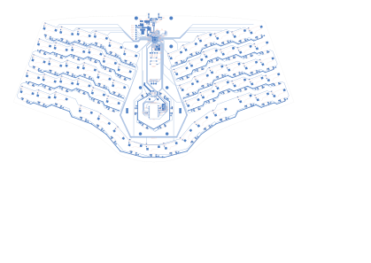

# Honeydew
~60% 63-key QMK-compatible unsplit ergonomic keyboard.

## Disclaimer
The layout is based on the [Cantaloupe](https://github.com/Ariamelon/Cantaloupe) layout, but with each side rotated 20 degrees inwards and both haves making up one board.

## Key Features
* Ergonomic 63-key layout including pinky stagger and arrow keys, plus 3 keys in the middle.
* On-board Raspberry Pi RP2040 processor.
* SWD debug header.
* USB-C input with full ESD protection.
* MX switch support with kailh hot-swap sockets.
* Support for a 40mm cirque trackpad in the middle.
* Alternately supports a 34mm trackball, also in the middle.
* Both of the two options above have RGB backlight.
* Rotating ring around the trackball or trackpad.
* 1.5" 128x64 SSD1315 RGB QP OLED support.

## Changelog
* 03/03/2023: Initial public upload of V1.0.