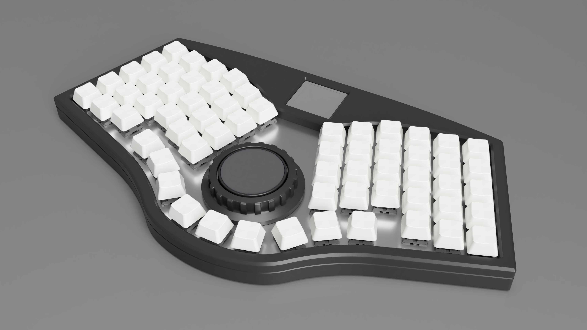

# Honeydew
~60% 63-key QMK-compatible unsplit ergonomic keyboard.

## Disclaimer
The layout is based on the [Cantaloupe](https://github.com/Ariamelon/Cantaloupe) layout, but with each side rotated 20 degrees inwards and both halves making up one board. This keyboard is licensed under CC BY 4.0.

## Key Features
* Ergonomic unsplit 60-key vertically staggered layout with thumb cluster, pinky stagger and arrow keys, plus 3 keys in the middle.
* Gasket-mounted case.
* On-board Raspberry Pi RP2040 processor.
* SWD header for debugging purposes.
* DIP switch and reset button for entering flash mode.
* USB-C input with full ESD protection.
* MX switch support with kailh hot-swap sockets.
* Per-key RGB backlight.
* 40mm cirque trackpad support in the middle.
* Alternately supports a 34mm trackball instead of the trackpad.
* The trackpad or trackball has an illuminated RGB ring.
* Rotary encoder ring around the trackball or trackpad.
* 1.5" 128x128 SSD1351 RGB QP OLED support.

## Changelog
* 14/03/2023: Fixed top and bottom case STEP files. Minor fix to silk.
* 13/03/2023: V1.1 update. Moved switch footprint center back to normal position. Swapped capacitor and resistor at USB-C connector for ferrite bead. Moved positions of USB VBUS protection. 
* 11/03/2023: Added PH2.0 header for OLED. Changed plate to accommodate headers. Better render.
* 10/03/2023: Fixed OLED description in readme. Changed center of switches for JLC assembly.
* 09/03/2023: Shifted MCU up to reduce length of USB traces. Added holes for JLC assembly. Attempted to render a better quality image.
* 08/03/2023: Added 3D render of case, case STEP files and plate DXF and gerbers.
* 07/03/2023: Rewording of readme. Added files for JLC PCBA. Changed USB C connector and moved it away from board.
* 06/03/2023: Minor repositioning of parts.
* 05/03/2023: Added mounting holes for trackpad/trackball mount. Added CC BY 4.0 license.
* 04/03/2023: Massive mistake corrections and clarifications. Changed 22R USB resistors to 27R. Readded missing pullup for RUN pin. Changed notation of power and ground rails to the standard. Connected RGB LEDs to 5V instead of 3V3. Added keycap model to render. Changed board showcase files from SVG to PDF. Fixed error in MCU sheet. Changed flash symbol to the one used in Kicad 7.
* 03/03/2023: Initial public upload of V1.0.
