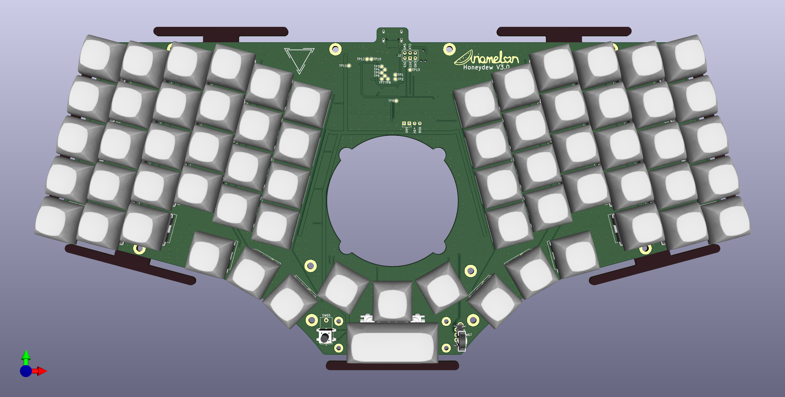
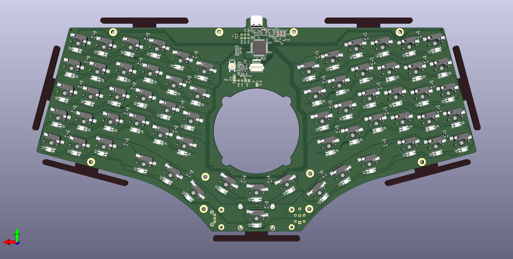

# Honeydew
~60% 63-key QMK-compatible unified split ergonomic keyboard with [VIK](https://github.com/sadekbaroudi/vik) module support.

## Disclaimer
This keyboard is licensed under CC BY 4.0, runs [QMK Firmware](https://qmk.fm/) and is compatible with the [VIK](https://github.com/sadekbaroudi/vik) standard. The layout is based on the [Cantaloupe](https://github.com/Ariamelon/Cantaloupe) layout, but with each half rotated 15 degrees inwards.

## Key Features
* Ergonomic unsplit 60-key vertically staggered layout with thumb cluster, pinky stagger and arrow keys, plus 3 keys around a center VIK module spot and a 2.25u key below that.
* Thumb scroll wheel at bottom of keyboard, replacing the 2.25u key in that position.
* Each half rotated 15 degrees inwards.
* On-board Raspberry Pi RP2040 processor.
* Uses 74HC595 shift registers for the columns.
* SWD header for debugging purposes.
* USB-C input with full ESD protection and up to 5V 3A of power depending on source capability.
* MX and choc hotswap switch support with kailh hotswap sockets.
* Per-key RGB backlight and ARGB header for adding more.
* 1.5" 128x128 SSD1351 RGB QP OLED support using the Waveshare breakout board [Waveshare breakout board](https://www.waveshare.com/wiki/1.5inch_RGB_OLED_Module) or the [Crenshaw](https://github.com/Ariamelon/Crenshaw)
* Gasket-mount case supporting 65 x 4 x 4mm gaskets with 25% compression (14 required).

## VIK keyboard certification card
| Category                 | Classification          | Response           |
| -----------------------  | ----------------------- | ------------------ |
| FPC connector            | Required                | :heavy_check_mark: |
| Breakout pins            | Recommended             | :x:                |
| Supplies: SPI            | Strongly recommended    | :heavy_check_mark: |
| Supplies: I2C            | Strongly recommended    | :heavy_check_mark: |
| I2C on main PCB          | Discouraged             | No                 |
| I2C pull ups             | Informative             | N/A                |
| Supplies: RGB            | Strongly recommended    | :heavy_check_mark: |
| Supplies: Extra GPIO 1   | Required                | Analog/Digital     |
| Supplies: Extra GPIO 2   | Required                | Analog/Digital     |

## Changelog
* 01/08/2023: Removed 3D files for trackpad mount and knob, moved to [Kiwano](https://github.com/Ariamelon/Kiwano) repository. Increased size of center hole in plate. Added renders with trackball configurations (refer to Kiwano).
* 31/07/2023: Removed button daughterboard. Reduced size of case and gaskets and added locating features. Added o-ring mounting for the PCB to the bottom case. Added fittings BOM.
* 30/07/2023: Added VIK keyboard certification card. Added USB connector back to PCB, but left the two buttons on a separate daughterboard. Modified case to accommodate large VIK module.
* 28/07/2023: Removed center ring encoder, cirque trackpad and PMW3360 support. Added VIK header and hole in the center of the PCB for the [Kiwano](https://github.com/Ariamelon/Kiwano). Changed JST connectors back to 20 pin FFC. Total rearrangement of parts in keyboard center. Stitched ground planes together. Added USB module to board rather than have it be separate.
* 26/07/2023: Slightly increased size of screw hole pads. Added two more screw holes. Added mounting holes to plate. Flipped gerbers for scrollwheel plate.
* 25/07/2023: Changed 8 pin JST SH connector to 6 pin. Pushed JST connectors back. Improved 3D model of SSD1351. Minor fix to PER56 footprint.
* 21/07/2023: Changed 20 pin FFC to 7 pin and 8 pin JST SH connector.
* 18/07/2023: Changed JST connector back to 20 pin FFC. Centered connector. Increased size of PMW3360 cutout.
* 17/07/2023: Changed 20 pin FFC connector to 14 pin JST SH connector. Repositioned components.
* 16/07/2023: Updated case file. Added individual case files. Added kicad plate files.
* 14/07/2023: Replaced 1N4148 switch diodes with BAV70. Replaced switch footprints with combination MX/Choc hotswap footprints. Replaced flash IC with much smaller version. Removed buttons and USB-C port and replaced it with an FFC connector for [Galia](https://github.com/Ariamelon/Galia) (a USB-C daughterboard designed specifically for the Honeydew). Added case STEP file and renders. Added footprint for PTS645 SMT and THT parts to the mouse switch in the thumb encoder.
* 06/07/2023: Replaced 0805 ferrite with 1206. Repositioned components.
* 30/06/2023: Routed 13V EN pin to the MCU. Removed 13V solder jumper.
* 27/06/2023: V3.0 initial update. Wired RST pin of OLED to MCU. Reduced size of OLED FFC cutout. Repositioned components. Added REF3033 3.3V voltage reference and connected it to the ADC input. Added pullup to RGB current limit switch enable input. 
* 11/06/2023: Updated BOM. Added new tentative plate file. Updated 3D files.
* 20/05/2023: Added scroll wheel rotary encoder and mouse switch for thumb scroll wheel, replacing bottom 2u key.
* 19/05/2023: Improved switch footprints. Changed 3v3 regulator to XC6206P332MR.
* 15/05/2023: Finished routing RGB LEDs.
* 05/05/2023: Changed PMOS switch to TPS2595, set to ~3A current limit. Got rid of RGB current measurement. Added enable jumper for 13V OLED PSU (only jump when in use to reduce noise when not in use). Still not done with RGB LED routing.
* 25/04/2023: Added current and voltage measurement for VBUS in and current measurement for the RGB output. Added PMOS power switch to fully turn off RGB LEDs when not in use. Rerouted the PCB. Moved OLED ribbon cable cutout and expanded it length-wise. Changed position of various components for better routing. Changed bulk capacitance of RGB LEDs to 5 x 22u capacitors. Changed the four N mosfets to two much smaller dual N mosfets. Still need to do RGB routing!
* 17/04/2023: Large update. Changed position of thumb buttons and added another button. Revamped shape of PCB again. Changed PER60 to PER56. Added 30-pin FFC receptacle for direct OLED panel mounting to the PCB (lower profile). Now using 595 shift registers for columns. Increased number of LEDs in central LED ring. Changed current limiting device to TPS2595. Connected current limiting ICs to MCU, allowing for software monitoring of current levels and changing of allowed current. Removed individual RGB capacitors and added bulk capacitance.
* 10/04/2023: Shrunk size of PCB. Added plate DXF and gerbers. Removed split comms ports and ideal diode.
* 08/04/2023: Large update. Removed single-push reset circuit, added side buttons next to the USB ports. Added pi filter to VBUS and split comms ports for more voltage filtering. Completely revamped shape of PCB for more space efficiency. Pushed each side further out and OLED further down. Added TUSB320 CC logic controller and TPS2557 current limit switch to allow the board to safely draw up to 15W (5V 3A) of power. Added mounting holes on PCB. Removed ferrite between USB shield and ground. Replaced back to back P-mosfets with ideal diode setup. Removed QMK logo (sorry). Cleaned up schematic somewhat. Added large caps to output of TPS2557. Updated STEP file and file data. Added back ground plane. Fixed rotation of production files.
* 03/04/2023: Changed level shifter to cheaper model. Slightly changed USB-C footprint. Added single-push reset circuit and removed DIP switch. Updated readme and STEP file. Moved position of USB-C ports further out.
* 02/04/2023: Changed angle of each unsplit half to 15 degrees inwards instead of 20 degrees with corresponding change to PCB and plate shape. Re-did 5V routing on the board. Added ARGB header to attach external RGB strips. Removed reverse voltage/current schottky and added back to back P-mosfets to provide the same function. Added ferrite bead to VBUS for more voltage filtering. Changed ESD protection chip to TPD4E05U06DQAR. Added USB-C expansion headers for expansion boards using split comms with the same protections as the primary USB-C input port. Added M3 earth pad for connection to a metal case. Added solder jumper to select OLED voltage as it should work fine when powered by 5V, but the option to power from 3V3 is there if required. Case to follow..
* 31/03/2023: Connected DR (data-ready) pin of TM040040 to Motion pin of PMW3360 as they serve the same function. Connected reset pins to hardware reset button instead of MCU. Added locating features to CNC case, increased wall thickness by 1mm for better magnet support (4mm now instead of 3mm) and increased size of gaskets. Redesigned trackpad mount and rotary encoder knob to allow for the illuminated ring to show up better. Added powered by QMK logo to board.
* 24/04/2023: Added level shifter to the RGB signal, just in case.
* 14/03/2023: Fixed top and bottom case STEP files. Minor fix to silk.
* 13/03/2023: V2.0 initial update. Moved switch footprint center back to normal position. Swapped capacitor and resistor at USB-C connector for ferrite bead. Moved positions of USB VBUS protection. 
* 11/03/2023: Added PH2.0 header for OLED. Changed plate to accommodate headers. Better render.
* 10/03/2023: Fixed OLED description in readme. Changed center of switches for JLC assembly.
* 09/03/2023: Shifted MCU up to reduce length of USB traces. Added holes for JLC assembly. Attempted to render a better quality image.
* 08/03/2023: Added 3D render of case, case STEP files and plate DXF and gerbers.
* 07/03/2023: Rewording of readme. Added files for JLC PCBA. Changed USB C connector and moved it away from board.
* 06/03/2023: Minor repositioning of parts.
* 05/03/2023: Added mounting holes for trackpad/trackball mount. Added CC BY 4.0 license.
* 04/03/2023: Massive mistake corrections and clarifications. Changed 22R USB resistors to 27R. Readded missing pullup for RUN pin. Changed notation of power and ground rails to the standard. Connected RGB LEDs to 5V instead of 3V3. Added keycap model to render. Changed board showcase files from SVG to PDF. Fixed error in MCU sheet. Changed flash symbol to the one used in Kicad 7.
* 03/03/2023: Initial public upload of V1.0.